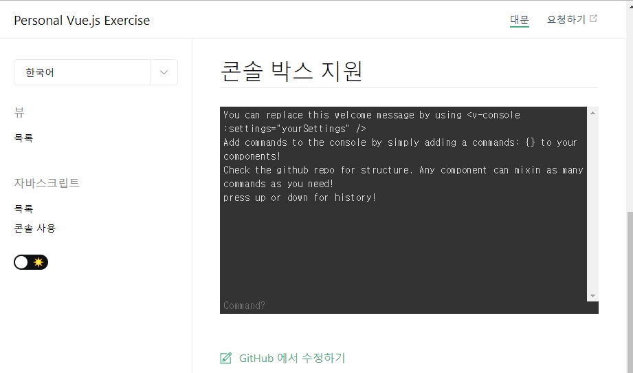
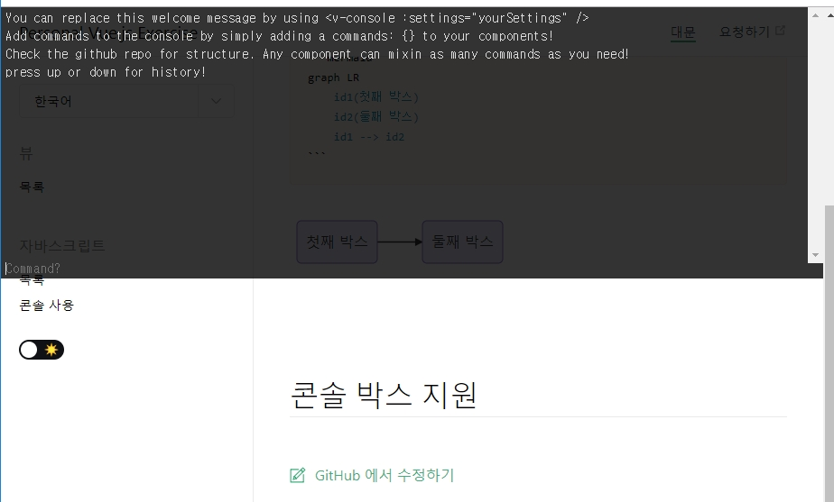

# Vue Custom Console [](https://npm.im/vue-custom-console)

Vue command console component can executes user's custom and display the result. 

It's based on [console.js v.1.2.2](https://github.com/amio/console.js/releases/tag/v1.2.0), and console.js dev tells that is for game console.

## Features

- console.js v1.2.2 features.
- hotKeyDisable
- elementShown vs systemShow mode

## Usage

Import And Register this plugin in your app:

```vue
<script>
import console from 'vue-custom-console'
Vue.use(console)

new Vue("some options");
</script>
```

use `<v-custom-console>` inside template:

```vue
<template>
    ......
  <v-custom-console />
    ......
</template>
```

## Options

### videoGameConsole

Make Console Like Video Game Console. You can press hotKey `~` to show console.

when no props value or `videoGameConsole = false` : 



when props value set true :

```vue
<template>
    ......
<v-custom-console 
  :videoGameConsole="true"
  :hotKeyDisable="false"
/>
    ......
</template>
```



> **You should use this options** with `:hotKeyDisable="false"`


### hotKeyDisable

Default hotKey is disabled. but when you set `videoGameConsole` to `true`, 
you should enabled hotKey features like below: 

```vue
<template>
    ......
  <v-custom-console 
    :hotKeyDisable="true"
  />
    ......
</template>
```

### settings

Override default console.js's settings.

1. Define custom options

```vue
<script>
export default{
    data(){
        return {
            overSettings : {
              commands: {
                support () {
                  // Do stuff here to initially setup your command
                  return {
                    // Guide is what shows up in the help system
                    guide: 'Contact a client speciailist',
                    // command is what gets executed when they type the command
                    command () {
                      // return is what is finally sent back to the console as output
                      return 'Contacting a client solutions specialist, hold on...'
                    }
                  }
                },
                reboot () {
                  return {
                    guide: 'Restarts the program',
                    command () {
                      setTimeout(function () { location.reload() }, 1000)
                      return '<span style="color: red">Rebooting...</span>'
                    }
                  }
                }
              }
            }
        }
    }
}

</script>

```

2. Pass it to `settings` props: 

```vue
<tempalte>
    <v-custom-console :settings="this.overSettings"/>
</tempalte>
```

below is props overridable and it's default value:

```js
    cmd: '', // The current console command
    logs: [], // The log stack
    history: [],
    historySelector: 0,
    commands: {},
    isShown: false,
    consolePos: 0,
    hotkey: 192 // default 192 `~'
    onShow: null,
    onHide: null,
    onEnter: null,
    onToggle: null,
    placeholder: 'Command?',
    helpCmd: 'guide',
    defaultHandler: null,
    caseSensitive: false,
    historySize: 256,
    welcome: `You can replace this welcome message by using &lt;v-console :settings="yourSettings" /><br>
    Add commands to the console by simply adding a commands: {} to your components!<br/>
    Check the github repo for structure. Any component can mixin as many commands as you need!<br/>
    press up or down for history!<br/>`
     
```